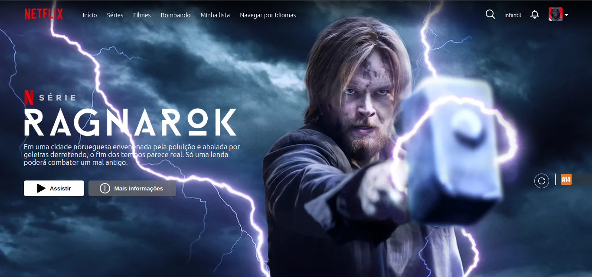

# Netflix Clone

Este é um projeto React criado com Vite que replica a página inicial da Netflix. Ele inclui um cabeçalho com links de navegação e informações sobre um filme fictício.

Você pode ver uma demonstração do projeto (https://vercel-clone-netflix.vercel.app/) 

# Recursos
- React
- HTML
- CSS
